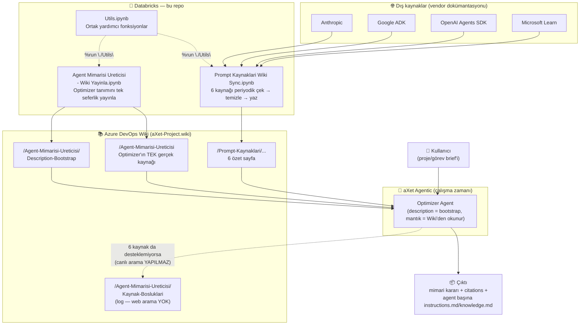
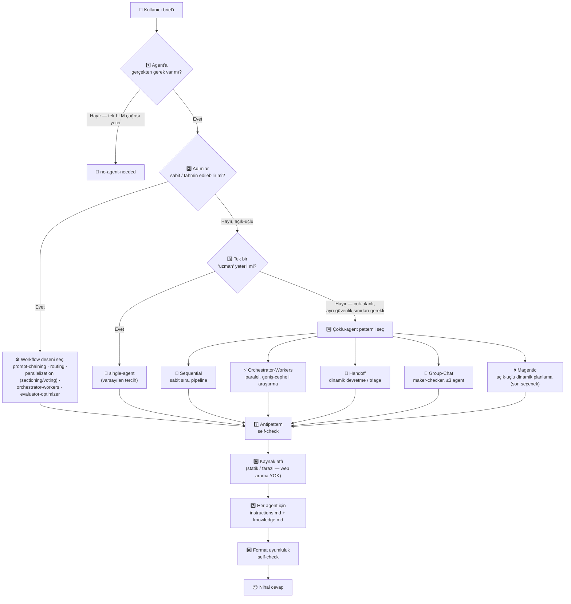

# 🧭 aXet Project — Agent Mimarisi Üretici Ekosistemi

> **Tek cümlelik özet:** Bu proje, herkesin kafadan attığı *"agent mi yapsam, kaç agent olsa, hangi düzende çalışsın?"* sorusuna, güvenilir kaynaklara dayanan, tutarlı ve tekrarlanabilir bir cevap veren küçük bir Databricks + Azure DevOps Wiki + aXet Agentic ekosistemidir.

---

## 📑 İçindekiler

1. [Bu proje hangi sorunu çözüyor?](#-bu-proje-hangi-sorunu-çözüyor)
2. [Büyük resim — sistem mimarisi](#-büyük-resim--sistem-mimarisi)
3. [Bileşenler](#-bileşenler)
4. [Optimizer'ın karar mekanizması](#-optimizerın-karar-mekanizması)
5. [Kaynak disiplini — "neye dayanarak söylüyorsun?"](#-kaynak-disiplini--neye-dayanarak-söylüyorsun)
6. [Optimizer çıktısı neye benziyor?](#-optimizer-çıktısı-neye-benziyor)
7. [Referans kaynaklar](#-referans-kaynaklar)
8. [Geliştirme prensipleri](#-geliştirme-prensipleri)
9. [Versiyon geçmişi](#-versiyon-geçmişi-optimizer)
10. [Klasör yapısı](#-klasör-yapısı)
11. [Kurulum & çalıştırma](#-kurulum--çalıştırma)
12. [Sözlük](#-sözlük-mixed-audience-için)
13. [Sık sorulan sorular](#-sık-sorulan-sorular)

---

## 🎯 Bu proje hangi sorunu çözüyor?

Bir ekip yeni bir AI/agent fikri geldiğinde genelde şu tartışmayla başlar:

> *"Buna tek bir agent mi yeter, yoksa birden fazla agent'ı mı zincirlemeliyiz? Paralel mi çalışsınlar, sırayla mı? Her birine ne yazacağız?"*

Bu proje bu tartışmayı **danışmanlaştırıyor**: kullanıcı bir proje/görev tanımını ("brief") serbest metin olarak yazar, **"Agent Mimarisi Üreticisi"** (kod adıyla **Optimizer**) bunu analiz eder ve şunları üretir:

- ✅ Agent'a gerek var mı, yoksa tek bir LLM çağrısı yeterli mi?
- ✅ Gerekiyorsa hangi mimari: tek-agent mı, sabit bir iş akışı (workflow) mı, yoksa çoklu-agent mi?
- ✅ Çoklu-agent ise hangi düzen: sıralı / paralel / dinamik devretme / grup-sohbet / açık-uçlu planlama?
- ✅ Her agent için kopyala-yapıştıra hazır **`instructions.md`** ve **`knowledge.md`** dosyaları
- ✅ Her önerinin **hangi kaynağa dayandığı** (uydurma yok — kaynaksız her şey açıkça işaretlenir)

Bu proje **kod üretmez, mimari + description üretir.** Kararların hepsi, aşağıda listelenen 6 adet endüstri kaynağına (Anthropic, Google, OpenAI, Microsoft) dayanır.

---

## 🗺️ Büyük resim — sistem mimarisi



**Okuma rehberi:**
- 🔵 **Sol taraf (Databricks)** — bu repo'nun tamamı. Sadece veri toplar ve Wiki'ye yazar; hiçbir "canlı" karar burada verilmez.
- 🟢 **Orta (Azure DevOps Wiki)** — sistemin *hafızası*. Hem referans kaynaklar hem Optimizer'ın tanımı burada tutulur.
- 🟣 **Sağ (aXet Agentic)** — Optimizer'ın gerçekten *çalıştığı* yer. Databricks'teki hiçbir şey Optimizer'ı doğrudan tetiklemez; Optimizer her istekte Wiki'yi okuyup güncel kalır.

---

## 🧩 Bileşenler

| Dosya | Ne işe yarar | Ne zaman çalışır | Wiki'ye ne yazar |
|---|---|---|---|
| **`Utils.ipynb`** | Ortak yardımcı fonksiyon kütüphanesi: Azure DevOps Wiki REST API (`get_wiki_page`, `create_wiki_page`, `update_wiki_page`, `push_wiki_page`) ve web erişimi (`check_robots_allowed`, `fetch_url_text`) | Diğer notebook'lar tarafından `%run "./Utils"` ile çağrılır | — (kendi başına yazmaz) |
| **`Prompt Kaynaklari Wiki Sync.ipynb`** | 6 statik vendor kaynağını (Anthropic, Google, OpenAI, Microsoft) çeker, HTML'den okunabilir markdown/JSON'a çevirir, agent-friendly formatta özetler | Periyodik / manuel (kullanıcı Databricks cluster'ından çalıştırır) | `/Prompt-Kaynaklari/*` — 6 özet sayfa + 1 index sayfası |
| **`Agent Mimarisi Ureticisi - Wiki Yayinla.ipynb`** | Optimizer'ın **tam tanımını** (rol, karar süreci, çıktı şeması) ve aXet Agentic kurulum ekranı için **kısa bir "bootstrap" açıklamasını** Wiki'ye yayınlar | Tek seferlik / versiyon değiştikçe manuel | `/Agent-Mimarisi-Ureticisi` + `/Agent-Mimarisi-Ureticisi/Description-Bootstrap` (+ Optimizer çalışma zamanında `/Agent-Mimarisi-Ureticisi/Kaynak-Bosluklari` sayfasına log yazar) |

> ⚠️ **Kritik mimari ayrım:** `Prompt Kaynaklari Wiki Sync.ipynb` **dışarıdan** veri çeker (vendor dokümantasyonu). `Agent Mimarisi Ureticisi - Wiki Yayinla.ipynb` ise **elle yazılmış, statik** bir agent tanımını yayınlar. İkisi birbirine karışmaz — biri "kaynak", diğeri "tanım" katmanıdır.

---

## 🧠 Optimizer'ın karar mekanizması

Optimizer, Microsoft Azure Architecture Center'ın *"doğru karmaşıklık seviyesinden başla"* prensibiyle çalışır: **her seviye ek koordinasyon/gecikme/maliyet getirir**, o yüzden Optimizer güvenilir şekilde çalışan **en düşük** seviyeyi önerir; bir üstüne sadece somut bir gerekçe varsa geçer.



| # | Adım | Kısaca |
|---|---|---|
| 1 | Agent gerekli mi? | Tek adımlı, tahmin edilebilir işler (özetleme, sınıflandırma) için agent önerilmez |
| 2 | Workflow deseni | 6 sabit desen: prompt-chaining, routing, parallelization (×2), orchestrator-workers, evaluator-optimizer |
| 3 | Single-agent | Açık-uçlu ama tek uzmanlık alanı yeterliyse — **kurumsal kullanımda genelde doğru varsayılan** |
| 4 | Çoklu-agent pattern'i | 5 alt-seçenek (aşağıdaki tablo) — **en fazla 5 agent**, aşılırsa gerekçe zorunlu |
| 5 | Antipattern kontrolü | Gereksiz karmaşıklık, anlamsız agent ekleme, çoklu-hop gecikmesi gibi hatalar taranır |
| 6 | Kaynak atfı | Her önerme statik-kaynaklı / farazi olarak damgalanır; farazi olan **Kaynak-Bosluklari** sayfasına log'lanır (canlı arama yok) |
| 7 | Dosya üretimi | Her agent için ayrı `instructions.md` (davranış) + `knowledge.md` (referans bilgi) |
| 8 | Self-check | JSON/markdown ayrımı, agent sayısı, dil kuralı, görsel yasağı — cevap verilmeden son kontrol |

### Çoklu-agent pattern'leri karşılaştırması

| Pattern | Ne zaman kullan | Ne zaman kullanma |
|---|---|---|
| 🔗 **Sequential** (pipeline) | Net doğrusal bağımlılıklar, aşamalı iyileştirme ("taslak → gözden geçir → cilala") | Adımlar bağımsızsa (paralel daha hızlı); erken adım hatası sonrakini bozabiliyorsa |
| ⚡ **Orchestrator–Workers** (paralel) | Geniş-cepheli, bağımsız alt-görevler; tek context window'u aşan hacim; ~15x token maliyetini karşılayacak değer | Ağır paylaşılan state / güçlü bağımlılık varsa |
| 🔀 **Handoff** (dinamik devretme) | En uygun uzman önceden bilinmiyor, ihtiyaç iş sırasında ortaya çıkıyor | Doğru sıra girdiden zaten anlaşılıyorsa (bunun yerine deterministik `routing` kullan) |
| 💬 **Group-Chat** (maker-checker) | Fikir geliştirme, editoryal inceleme, konsensüs gerektiren kararlar | Basit devretme/pipeline yeterliyse |
| 🌀 **Magentic** (dinamik planlama) | Çözüm yolu tamamen belirsiz + dış sistemleri değiştirebilen tool'lu agent'lar gerekiyor | Zaman-hassas işler, deterministik yol mümkünse — **varsayılan olarak önerilmez** |

---

## 🔍 Kaynak disiplini — "neye dayanarak söylüyorsun?"

> ⚠️ **v0.11 değişikliği:** Optimizer'ın **canlı internet erişimi/web arama tool'u yoktur ve kullanılmaz.** Önceki versiyonlarda (v0.6–v0.10) var olan "web arama fallback'i" **tamamen kaldırıldı** — çünkü aXet Agentic'teki Optimizer agent'ına fiilen bağlı bir web arama connector'ı yoktu; Wiki'deki talimat, agent'ın sahip olmadığı bir yeteneği vaat ediyordu. Bunun yerine **kaynak boşlukları artık taklit edilmez, görünür kılınır.**
>
> Gerçekten bir web erişim connector'ı bağlanırsa (allowlist bazlı, onaylı URL fetch), bu ayrı ve bilinçli bir konfigürasyon adımı olarak ele alınmalı — Optimizer'ın kendi kendine "arama yaptım" iddia etmesi değil.

Optimizer'ın verdiği **her** öneri, iki kategoriden birine açıkça damgalanır — hiçbir şey "genel bilgiymiş gibi" sessizce sunulmaz:

| Tür | Ne anlama gelir | Örnek işaret |
|---|---|---|
| 🟢 **Statik-kaynaklı** | 6 referans Wiki sayfasından birine açıkça dayanıyor — **her zaman en yetkili kaynak** | `citations[].source` |
| ⚪ **Farazi / çıkarımsal** | 6 statik kaynaktan hiçbiri desteklemiyor — agent web'e çıkmaz, kendi makul varsayımını yapar **ve bu boşluğu Wiki'ye log'lar** | `assumptions` alanında listelenir + `/Agent-Mimarisi-Ureticisi/Kaynak-Bosluklari` sayfasına kayıt düşülür |

Her cevabın **en başında** şu formatta bir özet yer alır:

> *"10 önerme üretildi: 8 statik-kaynaklı, 2 farazi/çıkarımsal (2 tanesi Kaynak-Bosluklari'na log'landı)"*

### Neden "web arama" yerine "boşluk log'lama"?

| | Web arama (v0.6–v0.10, kaldırıldı) | Boşluk log'lama (v0.11, güncel) |
|---|---|---|
| Gerekli altyapı | Agent'a **bağlı bir web fetch/arama connector'ı** | Sadece mevcut Azure DevOps Wiki connector'ı |
| Risk | Bağlı olmayan bir tool'u "varmış gibi" vaat etme | Yok — sadece dürüst bir kayıt |
| Sonuç | Ya sessizce çalışmaz ya da tutarsız/güncel-olmayan sonuç riski | Ekip, hangi konuda yeni statik kaynak eklemesi gerektiğini görür |
| Kalıcılık | Her run'da tekrar aranır, kaynak asla "resmileşmez" | Log birikir → ekip inceler → gerekirse `/Prompt-Kaynaklari/...` altına **kalıcı** statik kaynak eklenir |

---

## 📤 Optimizer çıktısı neye benziyor?

Çıktı **iki ayrı parçadan** oluşur ve bu iki parça birbirine **asla** karıştırılmaz:

**1️⃣ Karar/atıf metadata'sı — tek bir JSON bloğu:**

```json
{
  "optimizer_version": "0.11",
  "sourcing_summary": "10 önerme üretildi: 8 statik-kaynaklı, 2 farazi/çıkarımsal (2 tanesi Kaynak-Bosluklari'na log'landı)",
  "task_summary": "...",
  "architecture": "multi-agent-sequential",
  "rationale": "...",
  "citations": [ { "claim": "...", "source": "/Prompt-Kaynaklari/..." } ],
  "assumptions": ["..."],
  "agents": [ { "role": "sequential-step", "name": "Veri-Toplayici" } ],
  "execution_order": "Veri-Toplayici -> Analiz-Edici -> Raporlayici",
  "antipattern_check": "..."
}
```

**2️⃣ Her agent için, JSON'un tamamen dışında, kopyala-yapıştıra hazır iki markdown dosyası:**

```
### Veri-Toplayici - instructions.md
```markdown
# Veri-Toplayici
## Role
...
## Objective / Output Format / Boundaries / Scale Hint / Tools
...
```
### Veri-Toplayici - knowledge.md
```markdown
## Citations
...
## Assumptions
...
```
```

> 💡 **Neden ayrı?** aXet Agentic'te agent kurulurken *Instructions* ve *Knowledge* alanları ayrı ayrı doldurulur. Tek bir JSON string'i içine gömülmüş markdown, kullanıcının elle ayıklaması gerektiği için **kesinlikle kullanılmaz** (v0.9'da düzeltilen bir regresyon — bkz. versiyon geçmişi).

**Optimizer asla üretmez:** kod, görsel, resim, diyagram, mermaid şeması. Çıktı sadece metin/markdown/JSON'dur.

---

## 📚 Referans kaynaklar

Optimizer'ın karar mantığının **tek gerçek dayanağı** bu 6 kaynak (hepsi vendor/resmi dokümantasyon, robots.txt kontrolü yapıldı):

| # | Kaynak | Odak noktası |
|---|---|---|
| 1 | **Anthropic** — Building Effective Agents | Workflow vs. agent ayrımı, temel desenler, tool/description yazım prensipleri |
| 2 | **Anthropic** — How We Built Our Multi-Agent Research System | Ne zaman multi-agent'a geçilmeli, orchestrator-worker delegasyonu, subagent task yazımı |
| 3 | **Google ADK** — Sequential Agents | `SequentialAgent` sınıfı, sıralı zincirleme, `output_key` ile state aktarımı |
| 4 | **OpenAI Agents SDK** — Agent Orchestration | Kod üzerinden sıralı/paralel orkestrasyon, "agents as tools" vs "handoffs" |
| 5 | **Microsoft Semantic Kernel** — Sequential Orchestration | `SequentialOrchestration` sınıfı, agent pipeline örneği |
| 6 | **Microsoft Azure Architecture Center** — AI Agent Orchestration Patterns | "Doğru karmaşıklık seviyesi" tablosu, 5 pattern için "kullan/kullanma" listeleri, antipattern'lar |

Bu sayfalar Databricks tarafından periyodik çekilip `/Prompt-Kaynaklari/...` altında Wiki'de tutulur; **Optimizer bunları çalışma zamanında okur, kendi bilgisi olarak varsaymaz.**

---

## 🛠️ Geliştirme prensipleri

| # | Prensip |
|---|---|
| 1 | Databricks notebook'ları her zaman `.ipynb` — düz `.py` script yazılmaz |
| 2 | Tekrar eden kod `Utils.ipynb`'a taşınır, kopyala-yapıştır yapılmaz |
| 3 | `Utils.ipynb` markdown başlıklarıyla konularına göre gruplanır |
| 4 | Dış kaynak kullanmadan önce `robots.txt` + lisans/kullanım şartları kontrol edilir |
| 5 | Veri çekimi "nazik": paralel istek sınırlı, `Crawl-Delay`'e uyulur, maliyet göz önünde bulundurulur |
| 6 | İndirilen ham dosyalar (xlsx/csv) işlendikten hemen sonra silinir — repo'da kalıcı veri tutulmaz |
| 7 | Wiki içeriği AI agent'ın kolayca parse edebileceği şekilde tasarlanır (metadata + schema fenced JSON) |
| 8 | Her değişiklik hem GitHub hem Azure DevOps remote'una push edilir |

> 🔒 **Ayrıca kritik bir kural:** Databricks notebook'unda çalıştırılacak/gerçek Wiki'ye yazma işlemi **aXet.code tarafından connector ile asla taklit edilmez.** Coding assistant sadece notebook'taki `content` değişkenini güncelleyebilir; fiili yazma her zaman kullanıcının kendi Databricks cluster'ından notebook'u çalıştırmasıyla olur. Bu, kullanıcının elindeki adımı elinden almamak ve ETag/versiyon durumunu netleştirmek içindir.

---

## 🕓 Versiyon geçmişi (Optimizer)

| Versiyon | Ne değişti |
|---|---|
| v0.1 – v0.3 | İlk karar süreci; Azure Architecture Center'ın "doğru karmaşıklık seviyesi" tablosuna göre yeniden yapılandırıldı, 5 çoklu-agent pattern'i eklendi |
| v0.4 | **Kaynak atfı zorunlu** hale getirildi — `sourcing_summary` + `citations` eklendi |
| v0.5 | `copy_paste_agent_blocks` eklendi; "agent asla görsel üretmez" kuralı netleştirildi |
| v0.6 | **Web arama fallback'i** eklendi (robots.txt kontrollü, run başına ≤3 arama), `/Web-Arama-Kayitlari` log sayfası |
| v0.7 | Tek blok yerine agent başına **ayrı `instructions.md` + `knowledge.md`** üretimi |
| v0.8 | `agents[i]` ile `instructions.md` arasındaki **veri dublikasyonu** kaldırıldı (`agents[i]` artık sadece `role`+`name`) |
| v0.9 | JSON/markdown çakışması (regresyon) düzeltildi — `agent_files` JSON şemasından tamamen çıkarıldı, markdown dosyaları JSON'un tamamen dışında sunulur |
| v0.10 | Dil kuralı (brief'in dilinde cevap), **≤5 agent** sınırı, format uyumluluk self-check (8. adım), `optimizer_version` alanı |
| **v0.11** *(güncel)* | **Web arama fallback'i tamamen kaldırıldı** (agent'a bağlı bir arama connector'ı yoktu) — yerine `/Kaynak-Bosluklari` sayfasına şeffaf log'lama eklendi, `sourcing_summary` yeniden iki-yönlü oldu |

> 📌 v0.6–v0.10 arası var olan web arama özelliği v0.11'de kaldırıldı (bkz. yukarıdaki [Kaynak disiplini](#-kaynak-disiplini--neye-dayanarak-söylüyorsun) bölümü). Domain denylist fikri de bu nedenle artık geçersiz.

---

## 📁 Klasör yapısı

```
aXet-Project/
├── README.md                                          ← bu dosya
├── AGENTS.md                                          ← SADECE aXet.code'un (coding assistant) hafızası
├── Utils.ipynb                                         ← ortak yardımcı fonksiyonlar
├── Prompt Kaynaklari Wiki Sync.ipynb                   ← 6 kaynağı çek → özetle → Wiki'ye yaz
├── Agent Mimarisi Ureticisi - Wiki Yayinla.ipynb       ← Optimizer tanımını + bootstrap'i Wiki'ye yayınla
└── .gitignore                                          ← *.xlsx / *.csv gibi ham veri dosyaları hariç
```

> ⚠️ `AGENTS.md`, **Optimizer'ın değil**, bu repo'da çalışan coding assistant'ın (aXet.code) kurallarını içerir. Optimizer'ın rolü/karar mantığı/çıktı şeması **sadece Azure DevOps Wiki**'de (`/Agent-Mimarisi-Ureticisi`) tutulur — iki "agent"ın hafızası bilerek karıştırılmaz.

---

## ⚙️ Kurulum & çalıştırma

**Gereksinimler:** Databricks workspace + cluster, Azure DevOps organizasyonuna PAT (Personal Access Token) erişimi.

| Ayar | Değer |
|---|---|
| Azure DevOps organizasyon | `ozanozeer` |
| Proje | `aXet Project` |
| Wiki | `aXet-Project.wiki` |
| Databricks Secret Scope | `sql-ozoezer` |
| Secret key (PAT) | `devopspac` |

**Çalıştırma sırası:**

```text
1. Utils.ipynb'a dokunmadan bırak (diğer notebook'lar otomatik %run eder)
2. Yeni/güncel referans kaynağı senkronize etmek için:
   → "Prompt Kaynaklari Wiki Sync.ipynb"'ı Databricks cluster'ında çalıştır
3. Optimizer tanımı değiştiyse:
   → "Agent Mimarisi Ureticisi - Wiki Yayinla.ipynb"'ı çalıştır
   → (push_wiki_page ETag ile otomatik create/update yapar)
4. aXet Agentic'te Optimizer agent'ını kurarken:
   → description alanına Description-Bootstrap sayfasındaki kısa metni yapıştır
   → Optimizer, gerçek mantığı her istekte Wiki'den kendi connector'ıyla okur
```

Repo hem **GitHub** (`origin`) hem **Azure DevOps** (`azure`) remote'una bağlıdır; her değişiklik ikisine de push edilir.

---

## 📖 Sözlük (mixed-audience için)

| Terim | Açıklama |
|---|---|
| **Notebook (`.ipynb`)** | Databricks'te kod + açıklama hücrelerinin bir arada tutulduğu dosya formatı |
| **Wiki (Azure DevOps)** | Projenin "hafızası" olarak kullanılan, versiyonlu, sayfa tabanlı bir belge deposu |
| **PAT / ETag** | PAT = API erişim şifresi; ETag = bir Wiki sayfasının "versiyon damgası", çakışmasız güncelleme için kullanılır |
| **aXet.code** | Bu repo'da kod yazan/düzenleyen coding assistant (yani bu README'yi yazan asistan) |
| **aXet Agentic** | Optimizer gibi agent'ların **çalıştırıldığı** platform — Databricks'ten ayrı bir sistem |
| **Optimizer** | "Agent Mimarisi Üreticisi" agent'ının kod adı — brief alır, mimari + description üretir |
| **Brief** | Kullanıcının serbest metinle yazdığı proje/görev tanımı |
| **Agent** | Belirli bir amaç için otonom çalışan, tool kullanabilen bir LLM örneği |
| **Workflow** | Adımları önceden sabit/belirli olan, LLM'in kendi planlamadığı iş akışı |
| **Orchestrator–Workers** | Bir merkezi agent'ın alt-görevleri belirleyip paralel worker'lara dağıttığı desen |
| **Handoff** | Bir agent'ın görevi başka bir uzman agent'a çalışma zamanında devretmesi |
| **Citations / sourcing_summary** | Her önerinin hangi kaynağa (statik/web/farazi) dayandığının izlenebilir kaydı |

---

## ❓ Sık sorulan sorular

**Bu proje kod mu üretiyor?**
Hayır. Optimizer sadece mimari kararı + her agent için description/instructions/knowledge dosyaları üretir. Kod yazmaz.

**Databricks ile aXet Agentic arasındaki bağlantı gerçek zamanlı mı?**
Hayır. Databricks periyodik/manuel olarak Wiki'yi güncel tutar; Optimizer her isteğinde Wiki'yi kendi connector'ıyla okur. İkisi arasında doğrudan bir tetikleme yoktur.

**Optimizer bir şeyi nereden bildiğini nasıl kanıtlıyor?**
Her önerme `citations` listesinde kaynak+tür (statik/web/farazi) ile damgalanır; cevabın en başında toplu bir `sourcing_summary` sunulur.

**Kaç agent önerebilir?**
En fazla 5. Daha fazlası gerekiyorsa bu açıkça gerekçelendirilmek zorunda.

**Bu README'yi kim/nasıl güncel tutuyor?**
İçerik notebook'lardaki gerçek koddan ve `AGENTS.md`'deki değişiklik geçmişinden derlenmiştir; yeni bir versiyon (`v0.11+`) çıktığında bu dosya da güncellenmelidir.
